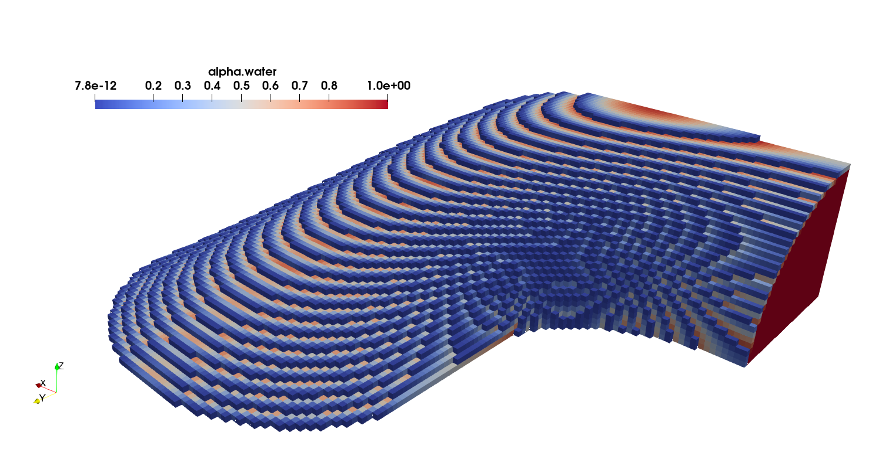

# argo  

The "argo" project is an [OpenFOAM](https://develop.openfoam.com/Development/openfoam) module that implements unstructured Lagrangian / Eulerian Interface (LEIA) methods for multiphase flow simulations in complex geometries.

## Authors

* **Tomislav Maric** - *Development* - [MMA, TU Darmstadt](https://www.mma.tu-darmstadt.de/index/mitarbeiter_3/mitarbeiter_details_mma_43648.en.jsp)

* **Tobias Tolle** - *Development* - [MMA, TU Darmstadt](https://www.mathematik.tu-darmstadt.de/fb/personal/details/tobias_tolle.de.jsp)

* **Dirk Gründing** - *Development* - [MMA, TU Darmstadt](https://www.mma.tu-darmstadt.de/index/mitarbeiter_3/mitarbeiter_details_mma_47488.en.jsp)

## Publications 

[1] [Tolle, T., Gründing, D., Bothe, D., & Marić, T. (2021). Computing volume fractions and signed distances from arbitrary surfaces on unstructured meshes. arXiv preprint arXiv:2101.08511.](https://arxiv.org/abs/2101.08511)

[2] [Hartmann, M., Fricke, M., Weimar, L., Gründing, D., Marić, T., Bothe, D., & Hardt, S. (2021). Breakup Dynamics of Capillary Bridges on Hydrophobic Stripes. International Journal of Multiphase Flow, 103582.](https://doi.org/10.1016/j.ijmultiphaseflow.2021.103582)

## License

This project is licensed under the GPL3.0 License - see the [LICENSE.md](LICENSE.md) file for details.

## Installation

These instructions will get your copy of the project up and running on your local machine for development and testing purposes. 

`argo` is a project that builds on [OpenFOAM](https://develop.openfoam.com/Development/openfoam) so it compiles and links against OpenFOAM libraries.  

### Compilation & Installation dependencies 

* Compiler:  g++ (GCC) 10.2.0
* Build system: cmake version 3.19.3

#### Computing dependencies

Meshing 

    * [gmsh](http://gmsh.info/) meshing software version 4.7.1, used for generating surface meshes
    * [cfmesh](https://cfmesh.com/cfmesh/), available as OpenFOAM sub-module, used for automatic generation of unstructured volume meshes

OpenFOAM

`argo` is based on OpenFOAM, git tag OpenFOAM-v2012

To install OpenFOAM follow the [instructions on installing OpenFOAM from sources](https://develop.openfoam.com/Development/openfoam/). 

1. Check out openfoam using git. 
2. Check out the git tag 

```
    ?> git checkout OpenFOAM-v2012
```
3. Compie OpenFOAM as instructed by its documentation. 

#### Post-processing dependencies

We use [Jupyter notebooks](https://jupyter.org/) for visualization and processing of test results, and following packages (may be differently named on your Operating System) 

* python, python-pandas, python-numpy, python-jupyter

### Installing `argo`

`argo` is built using the [CMake](https://cmake.org) build system.  

Execute following command to build `argo` and install its libraries and executables in the OpenFOAM PATH structure, once you have installed all its dependencies listed above. Inside the `argo` directory, call

```
    ?> ./install.sh
```

#### Manual compilation 

`argo` can be built by directly calling `cmake`

```
?>  mkdir build && cd build 
?>  cmake -DCMAKE_INSTALL_PREFIX=./ -DCMAKE_BUILD_TYPE=Release -DCMAKE_EXPORT_COMPILE_COMMANDS=on ..
?>  make && make install
```

where the flag `-DCMAKE_EXPORT_COMPILE_COMMANDS=on` is optional (it instructs CMake to create a `compile_commands.json` file).

## Examples 

### Experimental fluid interface

The case with the experimental surface from [[1](https://arxiv.org/abs/2101.08511)] and [[2](https://doi.org/10.1016/j.ijmultiphaseflow.2021.103582)] is available in 

```
argo/cases/3D-SFB1194-A02b
```

There are two scripts, `Allrunscmi` and `Allrunsmca`, that each generate the mesh and compute volume fractions, shown in the below figure 




## Contributing

The code is maintained at [GitLab](https://gitlab.com/leia-methods/argo). Feedback in the form of contributions, bug reports or feature requests is handled [TODO: Link to gitlab.com service desk](). 
